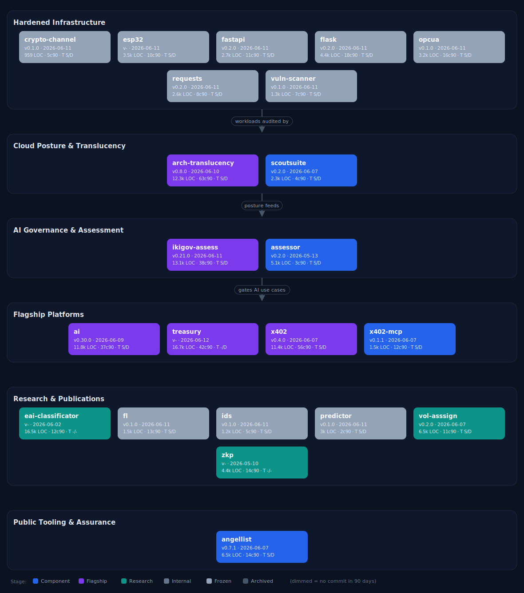

# PRESIDIO Hardened Public Portfolio

Public-facing snapshot of the PRESIDIO hardened component family: deployable hardened libraries, governance tools, cloud posture components, research artifacts, and flagship platforms. Non-public workspaces, scaffolding, and repository URLs are intentionally omitted.

*Generated 2026-06-12T10:43:03Z from the public subset of `presidio-projects-overview`.*

## Metrics snapshot

| Public components | LOC | Commits (90d) | Changes (90d) | Churn (90d) | Deployments | Static-tested | Dynamic-tested |
|---:|---:|---:|---:|---:|---:|---:|---:|
| 22 | 132.5k | 401 | 2517 | 228.6k | 34 | 19 | 20 |

## Hardened Infrastructure

Drop-in hardened replacements for standard libraries and runtimes — the secure substrate an org deploys.

| Project | Stage | Version | Updated | Metrics | Purpose |
|---|---|---|---|---|---|
| [crypto-channel](https://github.com/presidio-v/presidio-hardened-crypto-channel) | Frozen | `0.1.0` | 2026-06-11 | 959 LOC; 5 commits/90d; 31 changes; tests S/D; deploy | Secure cryptographic channel demonstrating ECDH key exchange, AES-256-GCM |
| [esp32](https://github.com/presidio-v/presidio-hardened-esp32) | Frozen | `-` | 2026-06-11 | 3.5k LOC; 10 commits/90d; 61 changes; tests S/D; deploy | Add presidio-hardened-esp32 to any ESP-IDF v5.0+ project and your existing code |
| [fastapi](https://github.com/presidio-v/presidio-hardened-fastapi) | Frozen | `0.2.0` | 2026-06-11 | 2.7k LOC; 11 commits/90d; 75 changes; tests S/D; deploy | A hardened, near drop-in replacement for FastAPI with strong security defaults. |
| [flask](https://github.com/presidio-v/presidio-hardened-flask) | Frozen | `0.2.0` | 2026-06-11 | 4.4k LOC; 18 commits/90d; 124 changes; tests S/D; deploy | A hardened drop-in replacement for Flask that automatically applies production-grade security defaults (v0.2.0). Change one import line and your existing Flask  |
| [opcua](https://github.com/presidio-v/presidio-hardened-opcua) | Frozen | `0.1.0` | 2026-06-11 | 3.2k LOC; 16 commits/90d; 65 changes; tests S/D; deploy | Hardened OPC UA wrapper with Presidio security extensions. |
| [requests](https://github.com/presidio-v/presidio-hardened-requests) | Frozen | `0.2.0` | 2026-06-11 | 2.6k LOC; 8 commits/90d; 54 changes; tests S/D; deploy | A 100% drop-in replacement for the Python |
| [vuln-scanner](https://github.com/presidio-v/presidio-hardened-vuln-scanner) | Frozen | `0.1.0` | 2026-06-11 | 1.3k LOC; 7 commits/90d; 47 changes; tests S/D; deploy | Web application vulnerability scanner with a deliberately vulnerable Flask app |

## Cloud Posture & Translucency

Continuous audit of cloud workloads and architectural transparency over what is actually running.

| Project | Stage | Version | Updated | Metrics | Purpose |
|---|---|---|---|---|---|
| [arch-translucency](https://github.com/presidio-v/presidio-hardened-arch-translucency) | Flagship | `0.8.0` | 2026-06-10 | 12.3k LOC; 63 commits/90d; 215 changes; tests S/D; deploy | Architectural translucency (Stantchev, ~2005) is the ability to monitor and |
| [scoutsuite](https://github.com/presidio-v/presidio-hardened-scoutsuite) | Component | `0.2.0` | 2026-06-07 | 2.3k LOC; 4 commits/90d; 59 changes; tests S/D; deploy | A Presidio security-hardened distribution of ScoutSuite, |

## AI Governance & Assessment

Assess and gate AI use cases against the IKI-Gov reference model and ISO certification evidence.

| Project | Stage | Version | Updated | Metrics | Purpose |
|---|---|---|---|---|---|
| [ikigov-assess](https://github.com/presidio-v/presidio-hardened-ikigov-assess) | Flagship | `0.21.0` | 2026-06-11 | 13.1k LOC; 38 commits/90d; 260 changes; tests S/D; deploy | IKI-Gov Assessment Tool — operationalises the IKI-Gov-Referenzmodell (Integrated KI-Governance Reference Model) as a practical CLI tool for assessing AI use cas |
| [assessor](https://github.com/presidio-v/presidio-assessor) | Component | `0.2.0` | 2026-05-13 | 5.1k LOC; 3 commits/90d; 57 changes; tests S/D; deploy | Evidence-gap analysis tool for ISO certification bodies. Reads a directory of |

## Flagship Platforms

Deep-research + software platforms that an org operates: payments, AI, treasury.

| Project | Stage | Version | Updated | Metrics | Purpose |
|---|---|---|---|---|---|
| [ai](https://github.com/presidio-v/presidio-hardened-ai) | Flagship | `0.30.0` | 2026-06-09 | 11.8k LOC; 37 commits/90d; 289 changes; tests S/D; deploy | Training-time privacy controls for AI. Where the rest of the toolkit governs |
| [treasury](https://github.com/presidio-v/presidio-hardened-treasury) | Flagship | `-` | 2026-06-12 | 16.7k LOC; 42 commits/90d; 304 changes; tests -/D; deploy | Audit-grade treasury close for crypto-first organizations. Flagship of the |
| [x402](https://github.com/presidio-v/presidio-hardened-x402) | Flagship | `0.4.0` | 2026-06-07 | 11.4k LOC; 56 commits/90d; 240 changes; tests S/D; deploy | Security middleware for the x402 payment protocol. |
| [x402-mcp](https://github.com/presidio-v/presidio-hardened-x402-mcp) | Component | `0.1.1` | 2026-06-07 | 1.5k LOC; 12 commits/90d; 42 changes; tests S/D; deploy | Pre-payment PII screener for x402 — agents call screen_payment_metadata(...) before signing, catching emails, SSNs, phone numbers, names, and other personal dat |

## Research & Publications

Publication-heavy work that underpins the platforms with models, proofs, and frameworks.

| Project | Stage | Version | Updated | Metrics | Purpose |
|---|---|---|---|---|---|
| [eai-classificator](https://github.com/presidio-v/presidio-hardened-eai-classificator) | Research | `-` | 2026-06-02 | 16.5k LOC; 12 commits/90d; 113 changes; tests -/-; no deploy | LaTeX sources for Borovac & Stantchev, An Enterprise AI Classification Framework for Business Transformation. Target venue: MDPI Information. |
| [fl](https://github.com/presidio-v/presidio-hardened-fl) | Frozen | `0.1.0` | 2026-06-11 | 1.5k LOC; 13 commits/90d; 47 changes; tests S/D; deploy | Privacy-preserving federated learning simulation for PRES-EDU-CS-101 |
| [ids](https://github.com/presidio-v/presidio-hardened-ids) | Frozen | `0.1.0` | 2026-06-11 | 1.2k LOC; 5 commits/90d; 36 changes; tests S/D; deploy | ML-based intrusion detection system with adversarial evasion and hardening. |
| [predictor](https://github.com/presidio-v/presidio-hardened-predictor) | Frozen | `0.1.0` | 2026-06-11 | 3k LOC; 2 commits/90d; 59 changes; tests S/D; deploy | A hardened CLI tool that connects to prediction markets, applies pluggable betting |
| [vol-asssign](https://github.com/presidio-v/presidio-hardened-vol-assign) | Research | `0.2.0` | 2026-06-07 | 6.5k LOC; 11 commits/90d; 117 changes; tests S/D; deploy | A production-ready Python CLI tool (pva) implementing the multi-objective volunteer assignment model from: |
| [zkp](https://github.com/presidio-v/presidio-hardened-zkp) | Research | `-` | 2026-05-10 | 4.4k LOC; 14 commits/90d; 62 changes; tests -/-; deploy | Reference implementation and experimental harness for the paper |

## Public Tooling & Assurance

Public support tooling and assurance material for the hardened product family.

| Project | Stage | Version | Updated | Metrics | Purpose |
|---|---|---|---|---|---|
| [angellist](https://github.com/presidio-v/presidio-hardened-angellist) | Component | `0.7.1` | 2026-06-07 | 6.5k LOC; 14 commits/90d; 160 changes; tests S/D; deploy | Presidio security-hardened deal-flow triage & due-diligence toolkit for |

---

**Public-scope note:** non-public workspaces, runbooks/templates, and repository URLs are excluded. Activity metrics use the last 90 days. Tests are evidence-based: S = static tooling/workflows, D = dynamic tests/test files.
