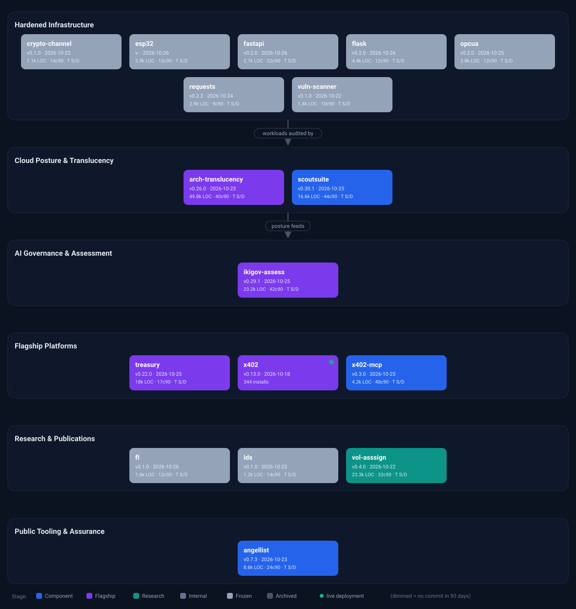

# PRESIDIO Hardened Public Portfolio

Public-facing snapshot of the PRESIDIO hardened component family: deployable hardened libraries, governance tools, cloud posture components, research artifacts, and flagship platforms. Non-public workspaces, scaffolding, and private repository URLs are intentionally omitted.

*Generated 2026-10-26T08:02:09Z from the public subset of `presidio-projects-overview`.*

## Metrics snapshot

| Public components | LOC | Installs | Commits (90d) | Changes (90d) | Churn (90d) | Deployments | PyPI publishers | Signed-tagged | Static-tested | Dynamic-tested |
|---:|---:|---:|---:|---:|---:|---:|---:|---:|---:|---:|
| 17 | 166.3k | 1.2k | 357 | 1395 | 83.1k | 32 | 12 | 13 | 16 | 16 |

## Live deployments

| Component | Service | URL | Live since | Requests |
|---|---|---|---|---|
| x402 | x402 Screening API | [screen.presidio-group.eu](https://screen.presidio-group.eu) | Apr 2026 | — |

## Hardened Infrastructure

Drop-in hardened replacements for standard libraries and runtimes — the secure substrate an org deploys.

| Project | Stage | Version | Updated | Metrics | Purpose |
|---|---|---|---|---|---|
| [crypto-channel](https://github.com/presidio-v/presidio-hardened-crypto-channel) | Frozen | `0.1.0` | 2026-10-22 | 1.1k LOC; 10 installs; 14 commits/90d; 18 changes; tests S/D; deploy; publish PyPI+TP+PEP740; tags 1/1 signed | Secure cryptographic channel demonstrating ECDH key exchange, AES-256-GCM |
| [esp32](https://github.com/presidio-v/presidio-hardened-esp32) | Frozen | `-` | 2026-10-26 | 3.5k LOC; 0 installs; 13 commits/90d; 14 changes; tests S/D; deploy; publish none; tags none | Add presidio-hardened-esp32 to any ESP-IDF v5.0+ project and your existing code |
| [fastapi](https://github.com/presidio-v/presidio-hardened-fastapi) | Frozen | `0.2.0` | 2026-10-26 | 2.7k LOC; 31 installs; 22 commits/90d; 26 changes; tests S/D; deploy; publish PyPI+TP+PEP740; tags 1/1 signed | A hardened, near drop-in replacement for FastAPI with strong security defaults. |
| [flask](https://github.com/presidio-v/presidio-hardened-flask) | Frozen | `0.2.0` | 2026-10-26 | 4.4k LOC; 11 installs; 12 commits/90d; 21 changes; tests S/D; deploy; publish PyPI+TP+PEP740; tags 1/1 signed | Hardened drop-in replacement for Flask with production security defaults applied automatically. |
| [opcua](https://github.com/presidio-v/presidio-hardened-opcua) | Frozen | `0.2.0` | 2026-10-25 | 3.8k LOC; 10 installs; 12 commits/90d; 21 changes; tests S/D; deploy; publish PyPI+TP+PEP740; tags 2/2 signed | Hardened OPC UA wrapper with Presidio security extensions. |
| [requests](https://github.com/presidio-v/presidio-hardened-requests) | Frozen | `0.2.2` | 2026-10-24 | 2.9k LOC; 9 installs; 9 commits/90d; 24 changes; tests S/D; deploy; publish PyPI+TP+PEP740; tags 3/3 signed | Hardened drop-in replacement for Python requests with secure defaults for TLS, timeouts, and defensive HTTP use. |
| [vuln-scanner](https://github.com/presidio-v/presidio-hardened-vuln-scanner) | Frozen | `0.1.0` | 2026-10-22 | 1.4k LOC; 8 installs; 10 commits/90d; 15 changes; tests S/D; deploy; publish PyPI+TP+PEP740; tags 1/1 signed | Web application vulnerability scanner with a deliberately vulnerable Flask app |

## Cloud Posture & Translucency

Continuous audit of cloud workloads and architectural transparency over what is actually running.

| Project | Stage | Version | Updated | Metrics | Purpose |
|---|---|---|---|---|---|
| [arch-translucency](https://github.com/presidio-v/presidio-hardened-arch-translucency) | Flagship | `0.26.0` | 2026-10-23 | 49.8k LOC; 137 installs; 40 commits/90d; 268 changes; tests S/D; deploy; publish PyPI+TP+PEP740; tags 20/26 signed | Architecture transparency tooling for monitoring running systems against intended deployment structure. |
| [scoutsuite](https://github.com/presidio-v/presidio-hardened-scoutsuite) | Component | `0.30.1` | 2026-10-25 | 16.6k LOC; 21 installs; 44 commits/90d; 121 changes; tests S/D; deploy; publish PyPI+TP; tags 4/4 signed | Security-hardened ScoutSuite distribution for cloud posture assessment. |

## AI Governance & Assessment

Assess and gate AI use cases against the IKI-Gov reference model and signed evidence records.

| Project | Stage | Version | Updated | Metrics | Purpose |
|---|---|---|---|---|---|
| [ikigov-assess](https://github.com/presidio-v/presidio-hardened-ikigov-assess) | Flagship | `0.29.1` | 2026-10-25 | 23.2k LOC; 360 installs; 42 commits/90d; 228 changes; tests S/D; deploy; publish PyPI+TP+PEP740; tags 12/31 signed | CLI assessment tool for evaluating AI use cases against the IKI-Gov reference model and evidence requirements. |

## Flagship Platforms

Deep-research + software platforms that an org operates: payments, AI, treasury.

| Project | Stage | Version | Updated | Metrics | Purpose |
|---|---|---|---|---|---|
| [treasury](https://github.com/presidio-v/presidio-hardened-treasury) | Flagship | `0.22.0` | 2026-10-25 | 18k LOC; 1 installs; 17 commits/90d; 57 changes; tests S/D; deploy; publish none; tags 1/1 signed | Audit-grade treasury close tooling for crypto-first organizations. |
| [x402](https://github.com/presidio-v/presidio-hardened-x402) | Flagship | `0.13.0` | 2026-10-18 | 344 installs; development metrics not published | Security middleware for the x402 payment protocol. |
| [x402-mcp](https://github.com/presidio-v/presidio-hardened-x402-mcp) | Component | `0.3.0` | 2026-10-25 | 4.2k LOC; 205 installs; 40 commits/90d; 127 changes; tests S/D; deploy; publish PyPI+TP+PEP740; tags 5/5 signed | MCP pre-payment PII screener for x402 payment metadata before an agent signs a request. |

## Research & Publications

Publication-heavy work that underpins the platforms with models, proofs, and frameworks.

| Project | Stage | Version | Updated | Metrics | Purpose |
|---|---|---|---|---|---|
| [fl](https://github.com/presidio-v/presidio-hardened-fl) | Frozen | `0.1.0` | 2026-10-26 | 1.6k LOC; 0 installs; 12 commits/90d; 19 changes; tests S/D; deploy; publish none; tags none | Privacy-preserving federated learning simulation for PRES-EDU-CS-101 |
| [ids](https://github.com/presidio-v/presidio-hardened-ids) | Frozen | `0.1.0` | 2026-10-22 | 1.2k LOC; 0 installs; 14 commits/90d; 17 changes; tests S/D; deploy; publish none; tags none | ML-based intrusion detection system with adversarial evasion and hardening. |
| [vol-asssign](https://github.com/presidio-v/presidio-hardened-vol-assign) | Research | `0.4.0` | 2026-10-22 | 23.3k LOC; 0 installs; 32 commits/90d; 342 changes; tests S/D; deploy; publish PyPI+TP; tags 3/4 signed | Python CLI implementation of a multi-objective volunteer assignment model. |

## Public Tooling & Assurance

Public support tooling and assurance material for the hardened product family.

| Project | Stage | Version | Updated | Metrics | Purpose |
|---|---|---|---|---|---|
| [angellist](https://github.com/presidio-v/presidio-hardened-angellist) | Component | `0.7.3` | 2026-10-23 | 8.6k LOC; 25 installs; 24 commits/90d; 77 changes; tests S/D; deploy; publish PyPI+TP+PEP740; tags 2/5 signed | Security-hardened deal-flow triage and due-diligence toolkit. |

---

**Public-scope note:** non-public workspaces, private repositories, and scaffolding are excluded. Activity metrics use the last 90 days. Tests are evidence-based: S = static tooling/workflows, D = dynamic tests/test files. Installs combine PyPI last-month downloads and GitHub release asset downloads where available. PyPI publishers are repos with an explicit publish workflow; signed-tagged counts repos with at least one signed Git tag object.
